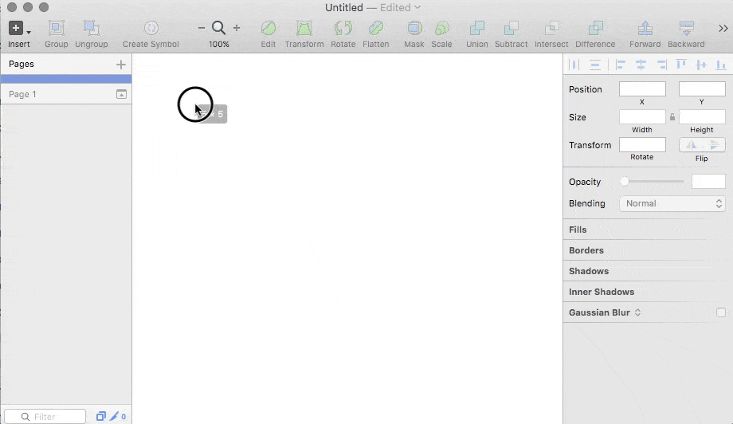

# Sketch Logo Fetcher

> Sketch.app plugin to search and insert logos from either the
> [Logos API](https://github.com/soulchild/logos-api) (user-contributed, SVG) or
> [Clearbit API](https://blog.clearbit.com/logo) (scraped from websites, PNG).

**IMPORTANT NOTICE:** Beginning with Sketch version 42, [App Transport Security has been enabled](http://developer.sketchapp.com/blog/2016-09-26-plugin-latest-v40/). 
**You'll need to upgrade to Sketch Logo Fetcher v0.3.2 or higher to make it work with the latest Sketch versions.**

## Demo

## Usage

1. Select a shape you want to fill with a logo
2. Go to `Plugins ▸ Logo fetcher` in Sketch's menu bar and select either `Insert SVG logo (Logos API)` or `Insert PNG logo (Clearbit API)`.

**Keyboard Shortcuts**

* Logos API: `Control` + `Command` + `K`
* Clearbit API: `Control` + `Command` + `L`

## Installation

### Via [Sketchpacks](https://sketchpacks.com/)

### Manual

1. Download and unzip the latest [release](https://github.com/soulchild/sketch-logo-fetcher/releases)
2. Doubleclick `sketch-logo-fetcher.sketchplugin` to install

## Thanks

Many thanks to [DG-i](https://www.dg-i.net) for hosting the [Logos API](https://github.com/soulchild/logos-api)!

## Author

  * [Tobias Kremer](https://www.github.com/soulchild)
